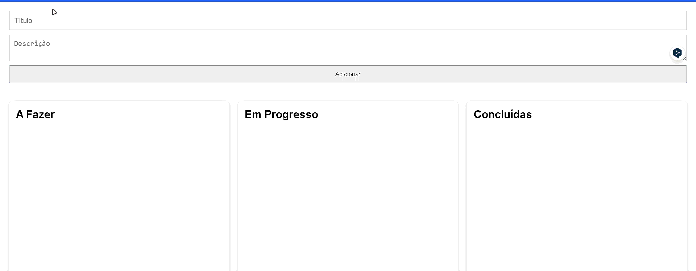
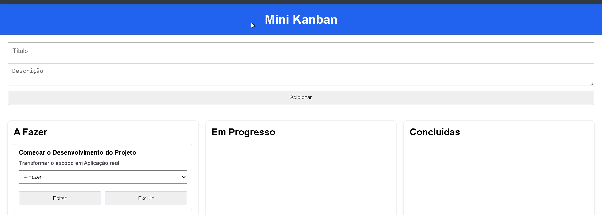
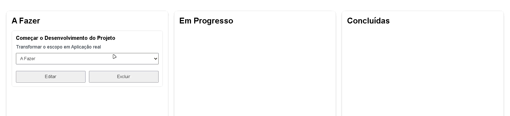
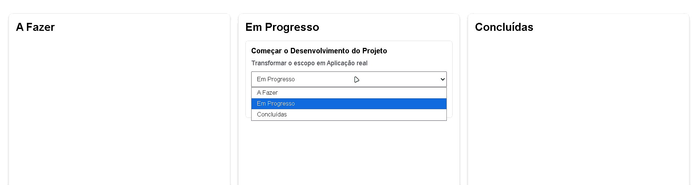
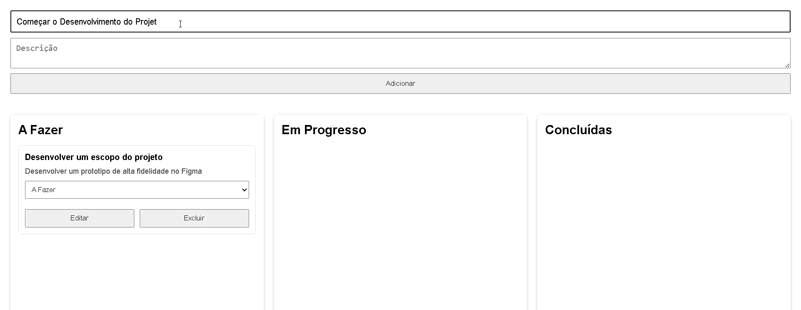
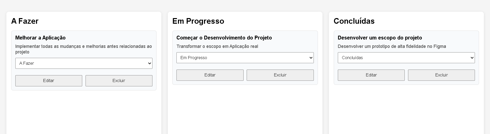

# Kanban Board

Projeto desenvolvido como desafio técnico utilizando Go e React.

---

## Tecnologias

### Backend

- Go
- Gorilla Mux
- API REST

### Frontend

- React
- Vite
- JavaScript

---

## Arquitetura

O projeto utiliza uma arquitetura em camadas (Layered Architecture), dividindo as responsabilidades entre frontend e backend.

### Backend

- main.go
- handlers.go
- models.go

### Frontend

- App.jsx
- Components
    - Header
    - Board
    - Column
    - Card
    - TaskForm

---

## Estrutura

backend/

```
main.go
handlers.go
models.go
```

frontend/

```
src/
components/
App.jsx
main.jsx
```

---

## Funcionalidades

✔ Criar tarefa



✔ Editar tarefa


✔ Excluir tarefa



✔ Alterar status

- A Fazer


- Em progresso


- Concluída


✔ Listar tarefas



✔ Separação em três colunas



- A Fazer
- Em Progresso
- Concluídas

---

## Fluxo da aplicação

Usuário

↓

React

↓

API REST

↓

Go

↓

Memória

↓

Resposta JSON

↓

React atualiza a interface

---

## Rotas da API

GET /tasks

Lista todas as tarefas.

---

POST /tasks

Cria uma nova tarefa.

---

PUT /tasks/{id}

Atualiza uma tarefa existente.

---

DELETE /tasks/{id}

Remove uma tarefa.

---

## Modelo da Task

```json
{
    "id": 1,
    "title": "Estudar React",
    "description": "Hooks",
    "status": "todo"
}
```

Status possíveis:

- todo
- doing
- done

---

## Como executar

### Backend

```bash
go run main.go
```

Servidor disponível em:

```
http://localhost:8080
```

---

### Frontend

```bash
npm install

npm run dev
```

Aplicação disponível em:

```
http://localhost:5173
```

---

## Melhorias futuras

- Persistência em banco de dados
- Drag and Drop
- Autenticação
- Responsividade
- Testes automatizados

---

## Autor

Jônatas Silva

GitHub:
https://github.com/Jonatasilva05

LinkedIn:
https://www.linkedin.com/in/jônatas-silva-714a9a216/

<br>


